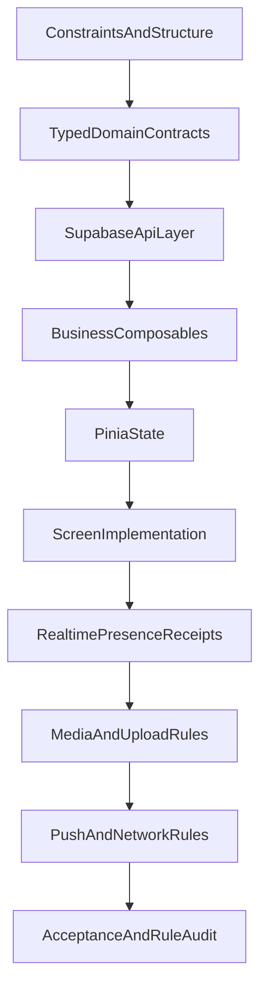

# План работ по ChatUp MVP

## 0) Базовые ограничения (фикс до старта)

- Зафиксировать стек и версии строго по ТЗ (Vue/Ionic/Pinia/Supabase/Capacitor) без добавления новых библиотек.
- Подтвердить архитектурные границы: UI только отображает, бизнес-логика только в composables, store только состояние, Supabase-вызовы только в API-слое.
- Принять структуру проекта из стандарта: `[d:/FrontEnd/Проекты в разработке/ChatUp/src/app](d:/FrontEnd/Проекты в разработке/ChatUp/src/app)`, `[d:/FrontEnd/Проекты в разработке/ChatUp/src/modules](d:/FrontEnd/Проекты в разработке/ChatUp/src/modules)`, `[d:/FrontEnd/Проекты в разработке/ChatUp/src/shared](d:/FrontEnd/Проекты в разработке/ChatUp/src/shared)`, `[d:/FrontEnd/Проекты в разработке/ChatUp/src/stores](d:/FrontEnd/Проекты в разработке/ChatUp/src/stores)`.

## 1) Контракты данных и типы (foundation)

- Описать строгие типы домена: `Profile`, `Conversation`, `Message`, `MediaMeta`, `MessageStatus`, `Presence`, `TypingEvent`, `RecordingEvent`, payload’ы realtime.
- Вынести union-типы вместо магических строк (например, `MessageType`, `MessageStatus`).
- Типы домена и типы payload’ов realtime. Без отдельного DTO-слоя и без общего маппинга.

## 2) API слой Supabase

- Реализовать изолированный API для: профиля, поиска пользователей, диалогов 1:1, сообщений, read receipts, presence, push token, media upload.
- API слой — это набор маленьких функций-обёрток над `supabase-js` без классов, без singleton-менеджеров, без ретраев, без кэша.
- Везде `async/await + try/catch`, без `.then/.catch`, без `any`, без логов в production.
- Заложить проверку уникальности `@username` перед сохранением и санитизацию `display_name`.

## 3) Composables (бизнес-логика)

- Реализовать composables по модулям: auth, profile, conversations, search, chat, realtime, network/push.
- Вынести lifecycle realtime: единая инициализация, одиночные подписки, обязательный cleanup при unmount.
- Реализовать broadcast-first и fallback (insert-subscription + sync on reconnect).

## 4) Stores (Pinia)

- Сделать минимальные и нормализованные store’ы: session/profile, conversations, active chat, message state, unread state.
- Pinia store хранит state и предоставляет actions, которые делегируют работу composables.
- Не хранить вычисляемые значения и локальный UI-state глобально; derived данные через `computed`.
- Поддержать статусы исходящих сообщений: `sending/sent/read/failed` и retry только для `failed`.

## 5) Экраны по ТЗ (в указанном порядке)

- `Splash/Boot`: восстановление сессии, загрузка профиля, запуск presence/realtime, проверка push token.
- `Onboarding`: 1–2 экрана, запрос push, сохранение флага прохождения.
- `Auth`: login/register email+password с валидацией и ошибками.
- `Conversations`: список 1:1 чатов, сортировка по последнему сообщению, unread badge, online indicator.
- `User Search`: поиск по `@username` и `display_name`, переход в чат.
- `Chat Room`: история+пагинация, отправка text/image/audio, realtime, typing, recording indicator, read receipts, offline banner.
- `Profile`: изменение `@username`, `display_name`, avatar, toggle уведомлений, re-init push token, logout.

## 6) Сообщения и медиа

- Реализовать text/image/audio строго по ограничениям: фото только из галереи, до 4 за отправку (каждое фото отдельным message), voice до 2 минут с preview.
- Реализовать media metadata в сообщении: `url`, `type`, `size`, `duration` (для audio).
- Добавить прогресс upload и явную обработку ошибок загрузки без блокировки UI.

## 7) Read receipts, presence, typing, recording

- Read receipts через per-conversation `last_read_at` по гибридному правилу (обновление только при достижении низа).
- Typing: `start` при первом вводе, keep-alive, `stop` через 3s без событий.
- Recording indicator: `recording:start/stop` и отображение в UI.
- Presence: online пока приложение активно, индикатор в списке чатов.

## 8) Push + Network поведение

- Push на каждое входящее сообщение (включая открытый чат), но не на свои сообщения.
- Формировать текст уведомления по типу сообщения (`text/photo/audio`) строго по шаблонам ТЗ.
- Сетевой контроль через Capacitor Network: при offline показывать баннер и блокировать/ошибать отправку.

## 9) Критерии приемки и финальная проверка

- Функциональная проверка всех экранов и сценариев ТЗ без добавленных “улучшений”.
- Техническая проверка по правилам: нет `any`, нет `console.*`, нет смешения слоев, нет неочищенных подписок, нет магических строк.
- Проверка ограничений архитектуры: без новых абстракций, без изменения структуры папок/версий пакетов.
- Проверка стабильности realtime/reconnect/offline сценариев и корректности message statuses/read receipts.

## Контроль потока работ

